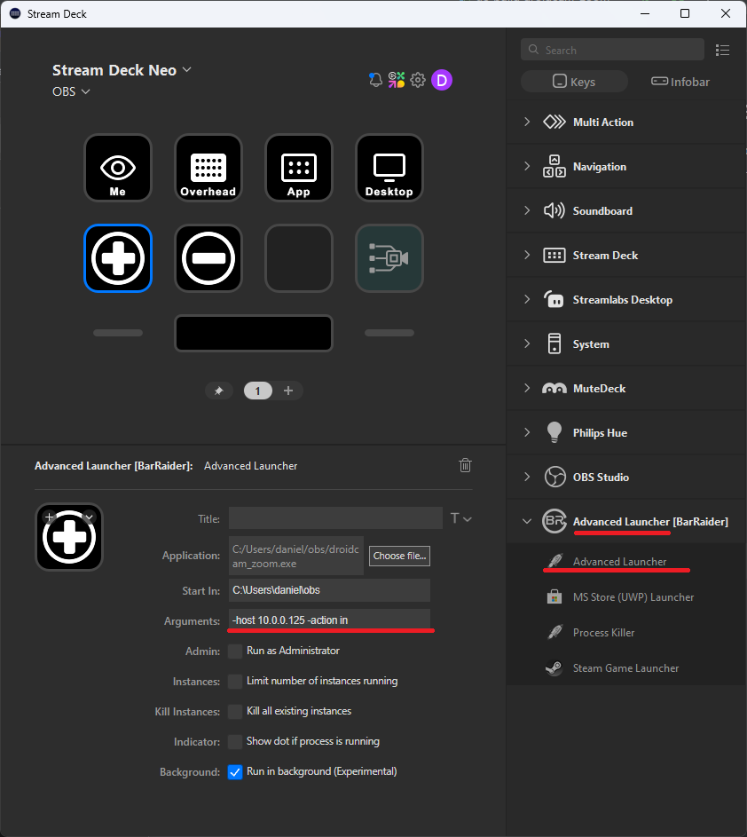

# Droidcam OBS Zoom tool for Stream deck

My limited search didn't find any easy way to control zoom of 
Droidcam OBS' zoom via a Stream deck. This is a simple binary 
that'll call the HTTP API (paid feature of Droidcam OBS) to 
zoom in and out.

## Usage
I've installed plugin "Advanced Launcher [BarRaider]" for Streamdeck.
I have set a button to execute the following action when it is pressed:

```droidcam_zoom.exe -host 192.168.1.2 -action in```

I recommend putting it with any streaming tools as it'll create a
`zoom.txt` to store the zoom level.

